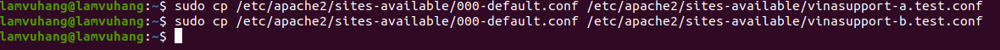

# Bai 1: Cài đặt apache 

sudo apt-get install apache2 -y
 

# Bai 2: Tạo virtual 

## Tạo thư mục lưu trữ web cho mỗi một Website.

*Tao thu muc*

sudo mkdir -p /var/www/html/vinasupport_a/public_html

sudo mkdir -p /var/www/html/vinasupport_b/public_html

*Them noi dung(su dung nano)*

sudo nano /var/www/html/vinasupport_a/public_html/index.html

sudo nano /var/www/html/vinasupport_b/public_html/index.html

## Phân quyền cho thư mục lưu trữ website

sudo chown -R www-data:www-data /var/www/html/vinasupport_a/public_html

sudo chown -R www-data:www-data /var/www/html/vinasupport_b/public_html

sudo chmod -R 755 /var/www/html

## Tạo file Virtual hosts config cho mỗi website

*Tạo file config bằng cách copy file template của file config.*

sudo cp /etc/apache2/sites-available/000-default.conf /etc/apache2/sites-available/vinasupport-a.test.conf

sudo cp /etc/apache2/sites-available/000-default.conf /etc/apache2/sites-available/vinasupport-b.test.conf

*Thay doi noi dung file config*

# Kích hoạt file config của Apache Virtual Hosts

*Vô hiệu hóa file config mặc định của Apache và kích hoạt file config cho 2 domain.*

sudo a2dissite 000-default.conf

sudo a2ensite vinasupport-a.test.conf

sudo a2ensite vinasupport-b.test.conf

*Sau đó khởi động lại Apache*

sudo systemctl reload apache2

## Test config

*Them domain*

*Test*

# Bai 3: Cấu hình thêm 1 virtual host có domain là google.com.vn (Hiện thị 1 trang html với dòng "Hello world"

