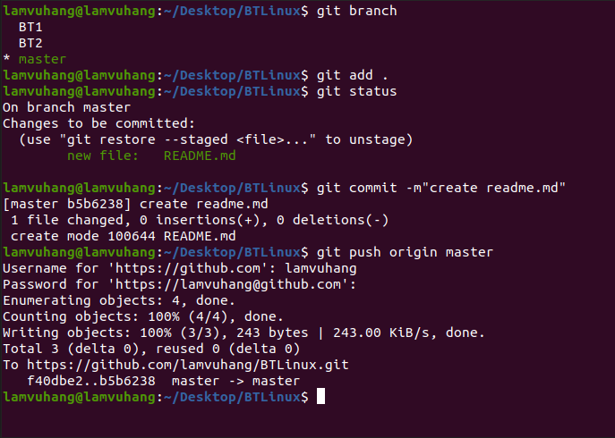
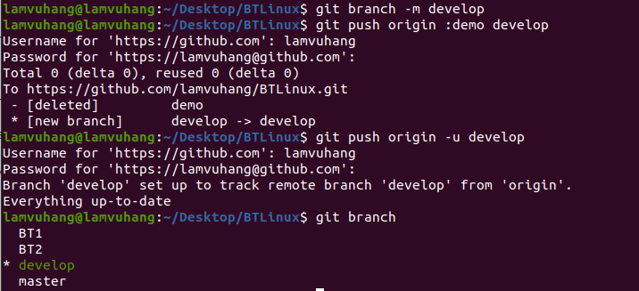
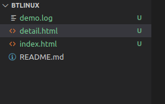

# Bài 1: config local user.name và user.email của mình

git config  user.name "lamvuhang"
 
git config  user.email "hanglam.24hdev@gmail.com"
 

 
# Bài 2: Tạo một file README.md, commit và push trên master 
 
## kiểm tra các branch:
 
git branch
 
## checkout về branch master:
 
git checkout master
 
## add file 
 
git add .
 
## commit file:
 
git commit -m"create readme.md"

## push file:

git push origin master

 
# Bài 3: Tạo một branch mới với name “demo” và sau đó đổi tên thành “develop”
 
## Tạo branch mới vơi tên "demo" và push
 
git checkout -b demo 
 
git push origin demo
 

 
## Đổi tên "demo" thành "develop"
 
git branch -m develop

git push origin :demo develop

git push origin -u develop
 

 
# Bài 4: Trên nhánh “develop”, tạo môt file demo.log, index.html, detail.html. Làm thế nào để git không tracking những file *.log. Sau đó tạo một commit.
 
## Tạo file demo.log, index.html, detail.html trên nhánh "develop"

 
## Tạo file .gitignore
 
touch .gitignore 

 
## Thêm nội dung vào file .gitignore
 

  
## Tạo commit
  
git add .
   
git commit -m"bt4"
  

 
# Bài 5: Thay đổi nội dung file index,html, detail.html và save. Sau đó revert lại nội dung commit gần nhất của 1 file index.html. Rồi tạo một commit mới, push.
 
## Thay đổi nội dung file index,html, detail.html và save.
 

  
## Revert lại nội dung commit gần nhất của 1 file index.html.
  
git chechout -- index.html
  

   

 
## Tạo một commit mới, push 
 
 

# BÀi 6: Từ master tạo một branch testing. Sau đó merge develop vào testing branch. Tạo một pull request merge testing vào master.

## Tạo branch testing từ master 

git checkout master 

git checkout -b testing

 
 
 ## Merge develop vào testing branch
 
 git merge develop

  

