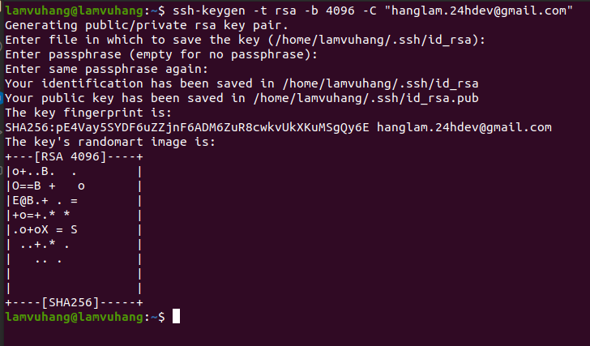

# Bai 1: Tạo 3 user(user-1, user-2, user-3), 2 group(groupA, groupB)

## Create user:
sudo useradd -m -c 'User1' user-1
sudo passwd user-1

sudo useradd -m -c 'User2' user-2
sudo passwd user-2

sudo useradd -m -c 'User3' user-3
sudo passwd user-3

## Create group:
sudo groupadd GroupA
sudo groupadd GroupB

# Bai 2:  Cho user-1, user-2 vào groupA, user-3 vào groupB

sudo usermod -a -G GroupA user-1
sudo usermod -a -G GroupA user-2

sudo usermod -a -G GroupB user-3

# Bai 3: Tạo file-a cho user-1 được 3 quyền (read write execute) và groupA chỉ có quyền read.

## Create file:
touch file-a.txt

## Change owner:
chown user-1:GroupA fife-a.txt  

## File permission:
sudo chmod 740 file-a.txt

# Bai 4: Connect SSH (dùng password) từ máy mình đến một máy bất kì trong mạng (upload 1 file từ máy mình và download 1 file về máy mình)

## Connect
ssh user-1@192.168.0.47

## Download 
scp -r user-1@192.168.0.47:duyen duyen

## Upload
scp -r hang user-1@192.168.0.47:hang

# Bai 5: Tạo SSH key để đặng nhập vào server (một máy của bạn bất kì trong mạng) không dùng mật khẩu

## Create ssh key

ssh-keygen -t rsa -b 4096 -C "hanglam.24hdev@gmail.com"

## Thêm public key vào authorized_key trên server

cat ~/.ssh/id_rsa.pub | ssh user-1@192.168.0.47 "mkdir -p ~/.ssh && touch ~/.ssh/authorized_keys && chmod -R go= ~/.ssh && cat >> ~/.ssh/authorized_keys"

## Connect without password 

ssh -i ~/.ssh/id_rsa user-1@192.168.0.47 

